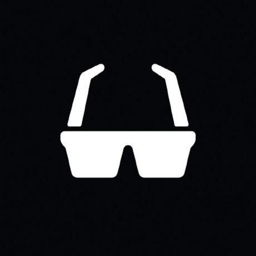
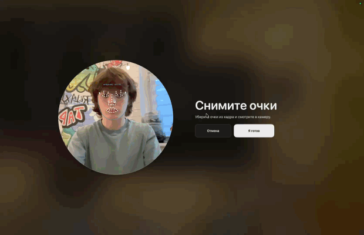
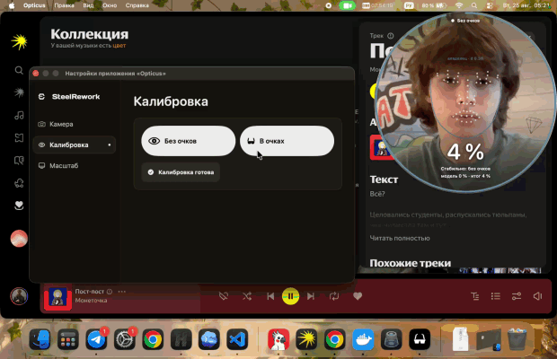
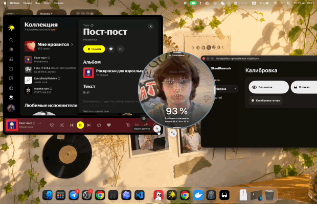
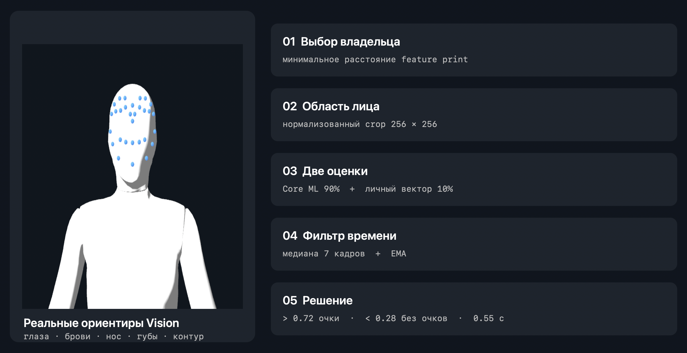
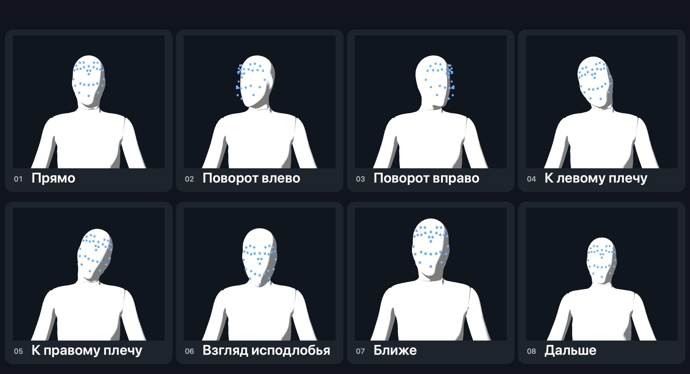

<p align="center">
  
</p>

<h1 align="center">Opticus</h1>

<p align="center">
  Mac сам меняет масштаб интерфейса, когда я снимаю или надеваю очки.
</p>

<p align="center">
  <a href="https://github.com/TimXa/Opticus/releases/latest"></a>
  <a href="#macos"></a>
  <a href="#сборка-из-исходников"></a>
  <a href="LICENSE"></a>
</p>

<p align="center">
  <a href="https://github.com/TimXa/Opticus/releases/latest">Скачать для macOS</a>
  ·
  <a href="#как-это-работает">Как это работает</a>
  ·
  <a href="https://t.me/SteelRework">SteelRework</a>
  ·
  <a href="https://t.me/TImXaa">Разработчик</a>
</p>

---

Я ношу очки и хотел, чтобы без них Mac становился удобнее сам. Так появился Opticus. Приложение находит моё лицо, определяет наличие очков и переключает заранее выбранный системный масштаб.

Вся обработка идёт локально. Камера не записывается, фотографии никуда не отправляются.

<table>
  <tr>
    <td width="50%">
      <strong><a href="https://github.com/TimXa/Opticus/releases/latest">Скачать Opticus</a></strong><br>
      <sub>GitHub Release · Apple Silicon · macOS 14+</sub>
    </td>
    <td width="50%">
      <strong><a href="https://github.com/TimXa/Opticus/tree/main/Sources/Opticus">Открыть исходники</a></strong><br>
      <sub>GitHub · Vision, Core ML и управление масштабом</sub>
    </td>
  </tr>
  <tr>
    <td width="50%">
      <strong><a href="https://t.me/SteelRework">SteelRework</a></strong><br>
      <sub>Telegram-канал · проекты и процесс разработки</sub>
    </td>
    <td width="50%">
      <strong><a href="https://t.me/TImXaa">Связаться с разработчиком</a></strong><br>
      <sub>Telegram · @TImXaa</sub>
    </td>
  </tr>
</table>

## Демо

GIF идут в реальном времени. По клику открывается полная запись 720p без звука.

### 1. Калибровка без очков

<a href="https://github.com/TimXa/Opticus/releases/download/v0.1.0/calibration-without-glasses.mp4">
  
</a>

Я показываю лицо в восьми положениях. Сегмент на окружности засчитывается только тогда, когда нужная поза действительно распознана.

[Смотреть запись калибровки без очков](https://github.com/TimXa/Opticus/releases/download/v0.1.0/calibration-without-glasses.mp4)

### 2. Калибровка в очках

<a href="https://github.com/TimXa/Opticus/releases/download/v0.1.0/calibration-with-glasses.mp4">
  
</a>

Второй проход создаёт профиль того же владельца в очках. Оправа может отличаться: основная модель работает вместе с персональными признаками, а не запоминает один снимок.

[Смотреть запись калибровки в очках](https://github.com/TimXa/Opticus/releases/download/v0.1.0/calibration-with-glasses.mp4)

### 3. Автоматическое переключение

<a href="https://github.com/TimXa/Opticus/releases/download/v0.1.0/automatic-scale-demo.mp4">
  
</a>

Я снимаю очки, решение стабилизируется, экран затемняется и macOS применяет другой режим. При повторном надевании очков возвращается исходный масштаб.

[Смотреть работу автоматического масштаба](https://github.com/TimXa/Opticus/releases/download/v0.1.0/automatic-scale-demo.mp4)

## Что умеет

| Механика | Что происходит |
| --- | --- |
| Выбор владельца | Если в кадре несколько лиц, Opticus сравнивает каждое с локальными шаблонами и выбирает ближайшее |
| Распознавание очков | Core ML классифицирует увеличенную область выбранного лица |
| Персональная поправка | Калибровочные векторы учитывают моё лицо, освещение и конкретные оправы |
| Защита от скачков | Одного ошибочного кадра недостаточно для смены масштаба |
| Системный масштаб | Для состояний «в очках» и «без очков» выбираются разные режимы дисплея |
| Фоновая работа | Кружок можно скрыть, распознавание продолжит работать из строки меню |
| Диагностика | Поверх камеры показываются реальные ориентиры лица и числа, участвующие в решении |

## Как это работает

<p align="center">
  
</p>

Нажмите на этап, чтобы раскрыть его механику.

<details>
<summary><strong>01 · Выбор владельца</strong></summary>

Apple Vision находит все лица и строит для каждого `feature print`. Opticus сравнивает их с двумя локальными отпечатками владельца и выбирает минимальное расстояние. Если оно не меньше `0.85`, масштаб не меняется. Код: [`FrameAnalyzer.analyze`](Sources/Opticus/FrameAnalysis.swift#L80).

</details>

<details>
<summary><strong>02 · Область лица</strong></summary>

Рамка выбранного лица расширяется на 8%, ограничивается границами кадра и приводится к `256 × 256` через `.scaleFill`. Остальные лица в классификатор не попадают. Код: [`predictEyeglasses`](Sources/Opticus/FrameAnalysis.swift#L252).

</details>

<details>
<summary><strong>03 · Две оценки</strong></summary>

Первая оценка приходит из ShuffleNet Core ML. Вторая строится по персональной калибровке: границы в областях глаз и переносицы, контраст глаз относительно щёк и симметрия. Итог:

```text
вероятность = Core ML × 0.90 + личная оценка × 0.10
```

В диагностике видны обе части: `модель`, `итог`, `d(очки)` и `d(без)`. Код: [`RecognitionSignal.fused`](Sources/Opticus/Recognition.swift#L71) и [`extractVector`](Sources/Opticus/FrameAnalysis.swift#L306).

</details>

<details>
<summary><strong>04 · Фильтр времени</strong></summary>

Берётся медиана последних семи измерений, затем применяется EMA: `62%` прошлого значения и `38%` новой медианы. Один неудачный кадр во время разговора не должен дёргать интерфейс. Код: [`TemporalDecisionFilter`](Sources/Opticus/Recognition.swift#L97).

</details>

<details>
<summary><strong>05 · Решение и масштаб</strong></summary>

Значение выше `0.72` означает «очки надеты», ниже `0.28` — «очки сняты». Новый результат должен удерживаться `0.55` секунды. Только после этого приложение меняет системный режим дисплея.

</details>

Камера и расчёты разделены. Превью остаётся плавным, тяжёлый анализ ограничен восемью кадрами в секунду, а Core ML использует CPU и Neural Engine.

## Как проходит калибровка

```text
8 поз × 3 измерения × 2 состояния = 48 векторов
```

<p align="center">
  
</p>

Синие точки на манекене показывают группы ориентиров и привязаны к глазам, носу, губам и линии подбородка. Это учебная схема: точные координаты Vision появляются только на реальном лице и видны в GIF выше.

| Поза | Что подтверждает кадр |
| --- | --- |
| Прямо | `|yaw| < 0.12` и `|roll| < 0.10` |
| Повороты | `yaw < -0.16` или `yaw > 0.16` |
| Наклоны | `roll > 0.15` или `roll < -0.15` |
| Взгляд исподлобья | меняется `pitch` или геометрия ориентиров, лицо остаётся почти прямо |
| Ближе | ширина лица больше базовой на 18% |
| Дальше | ширина лица меньше базовой на 18% |

Манекен показывает нужное движение, а `yaw`, `roll`, `pitch`, геометрия ориентиров и размер лица определяют, можно ли принять текущий кадр. Прогресс не должен расти просто от времени.

После каждого прохода сохраняются 24 шестимерных вектора и один feature print владельца. Снимки и отрывки видео не сохраняются.

Все восемь проверок заданы в [`CalibrationPose.matches`](Sources/Opticus/Recognition.swift#L190). Принятие кадров и сохранение профиля находятся в [`AppModel.swift`](Sources/Opticus/AppModel.swift).

## Что видно в режиме расчётов

- контур лица;
- точки глаз, бровей, носа и губ;
- выбранное лицо и расстояние до шаблона владельца;
- вероятность основной модели;
- итоговая вероятность;
- `d(очки)` и `d(без)`;
- `yaw`, `roll`, `pitch`;
- текущий шестимерный вектор;
- выдержка перед переключением.

Внутренние карты активаций нейросети не выводятся. Их сотни, и для диагностики решения они бесполезны.

## Установка

### macOS

Готовая сборка рассчитана на Apple Silicon и macOS 14 или новее.

1. Скачайте [последний релиз](https://github.com/TimXa/Opticus/releases/latest).
2. Распакуйте `Opticus-macOS.zip`.
3. Перенесите `Opticus.app` в `Applications`.
4. Разрешите доступ к камере при первом запуске.

Сборка пока не нотарифицирована. Если macOS остановит первый запуск, откройте «Системные настройки → Конфиденциальность и безопасность» и выберите «Всё равно открыть».

### Windows

Windows-релиза пока нет. Текущая версия напрямую использует AppKit, Apple Vision и Core Graphics, поэтому простой перекомпиляции недостаточно. Для Windows нужны отдельные камера, face landmarks и управление системным масштабом. Фальшивую кнопку загрузки ради красивого README я добавлять не стал.

## Сборка из исходников

Требования: macOS 14+, Xcode Command Line Tools и Swift 6.1.

```bash
git clone https://github.com/TimXa/Opticus.git
cd Opticus
swift test
./scripts/build_app.sh
```

Результат появится в `dist/Opticus-macOS.zip`.

Основные части проекта:

```text
Sources/Opticus/
├── AppModel.swift          состояние приложения и весь pipeline
├── FrameAnalysis.swift     Vision, выбор лица, Core ML и признаки
├── Recognition.swift       калибровка и временной фильтр
├── DisplayScaler.swift     режимы дисплея macOS
├── Views.swift             настройки, кружок и калибровка
└── OpticusApp.swift        окна, menu bar и жизненный цикл
```

## Стек

`Swift 6` · `SwiftUI` · `AppKit` · `Vision` · `Core ML` · `Core Image` · `SceneKit` · `Core Graphics`

## Ограничения

- это не Face ID и не система биометрической аутентификации;
- качество зависит от света, бликов и того, насколько лицо закрыто волосами;
- очень необычная оправа может потребовать повторной калибровки;
- приложение работает с состоянием очков на выбранном лице, а не ищет отдельные очки по всему кадру;
- автоматическая смена масштаба отключается на время калибровки.

Почему калибровка устроена именно так, разобрано в [инженерных заметках](docs/research.md). Отдельный файл [лицензий сторонних компонентов](THIRD_PARTY_NOTICES.md) нужен из-за Core ML-модели, шрифта и 3D-манекена, которые я не создавал с нуля.

## Связь

| Ссылка | Куда ведёт |
| --- | --- |
| [SteelRework](https://t.me/SteelRework) | проекты, обновления и процесс разработки |
| [Разработчик](https://t.me/TImXaa) | личный Telegram `@TImXaa` |

## Лицензия

[`LICENSE`](LICENSE) разрешает использовать и изменять исходный код Opticus при сохранении авторства. [`THIRD_PARTY_NOTICES.md`](THIRD_PARTY_NOTICES.md) выполняет то же обязательство перед авторами модели, шрифта и манекена. Эти файлы не участвуют в работе приложения, но без них публичный репозиторий был бы юридически неряшливым.
